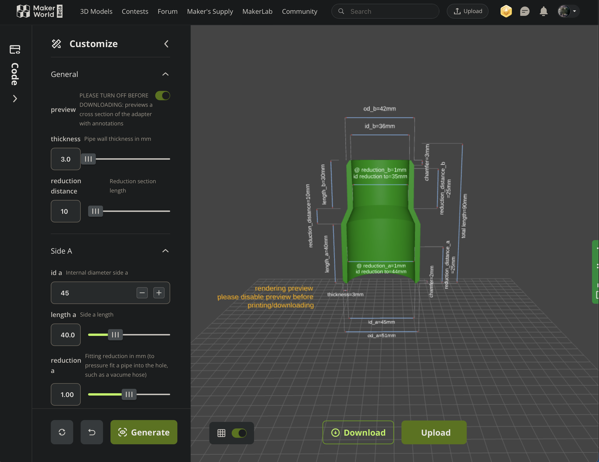
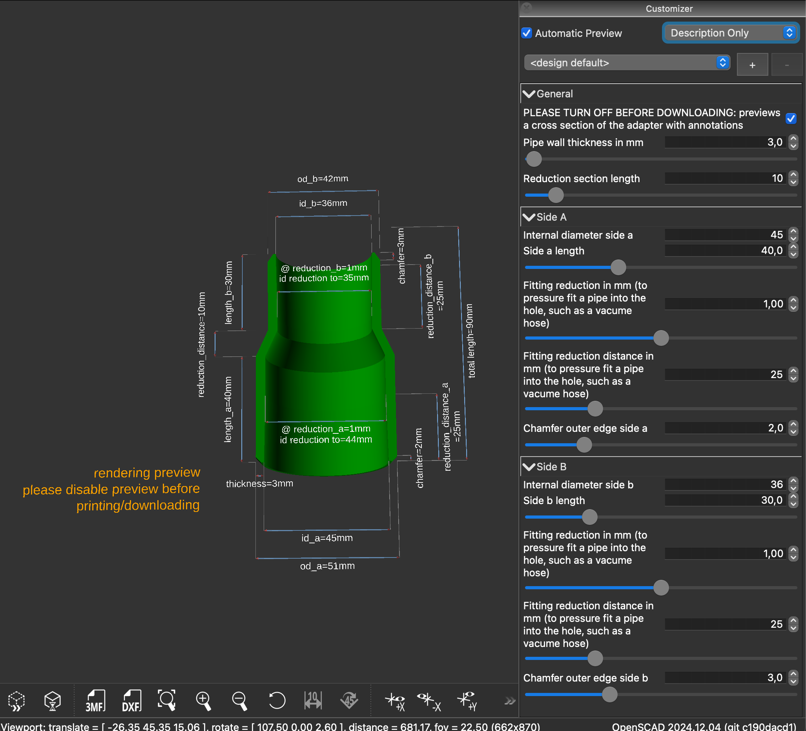

# Pipe adaptor generator

This implements a parametrised model for pipe, hose, vent, etc. adapters in OpenSCAD, intended to be 3d printed.
With this model you can generate an adapter that allows you to connect two pipes of different diameters together.

## Features

- Adapter with 2 simple cylindrically shaped sides of customisable diameter
- Customisable length reduction between the sides
- Customisable thickness
- Optional, customisable reduction within the 2 sides, for a friction fit.
- Optional, customisable chamfering on both sides
- Visual representation and exploded view with annotations.

## Generating an adapter

You have two options: MakerLab and OpenSCAD. MakerLab (part of MakerWorld) is an online GUI for OpenSCAD models that allow you to generate and/or send a generated model straight to a Bambu Lab printer. 

OpenSCAD is an open source editor for parametrised 3d modelling, a type of Scripted CAD software.

### MakerLab 

This model is [hosted on MakerWorld](https://makerworld.com/en/models/793144), where you can use the customiser to
generate an STL or send the generated model directly to a Bambu Lab printer.

### OpenSCAD

Alternatively, you can use the free and open source [OpenSCAD](https://openscad.org) editor. This is the editor that was used to create the model, and it allows you to customise and store customisation values too. 

In order to customise the model you should:

- Download and install OpenSCAD
- Download and open the [pipe-adapter.scad](pipe-adapter.scad) file in OpenSCAD
- Click: `View` in the menu bar, then untick: `Hide Customizer`.

This is what it should look like:

